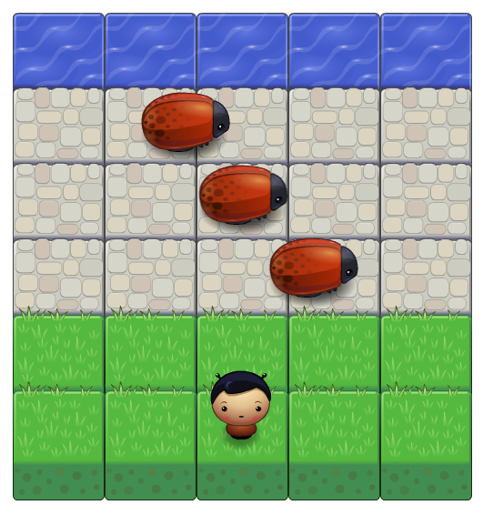
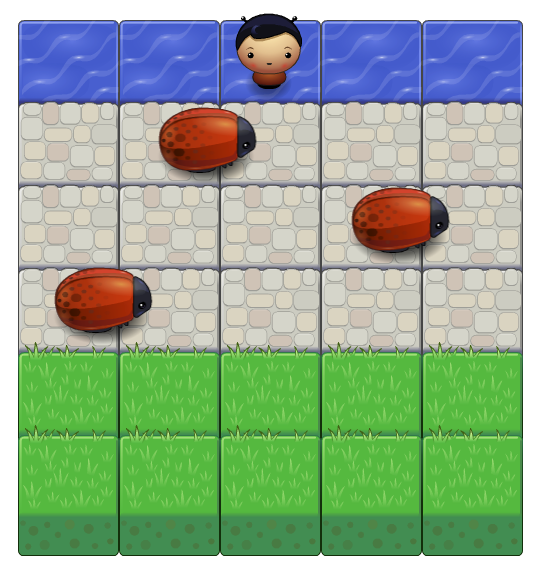
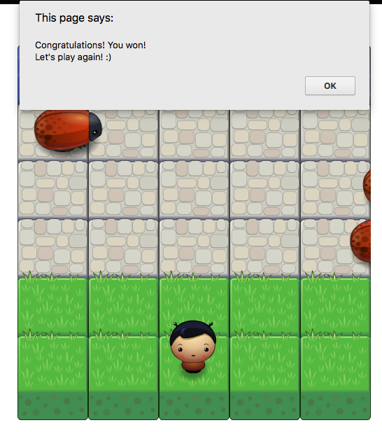

# Arcade Game Clone project

This is a project from Udacity Front End Nanodegree, for studying purposes.

#### To open the game:
* Download this git repository to a local machine</li>
* Open index.html</li>

#### To play:

The game starts with one player standing in the grass and 3 bugs running on the bricks from left to right in the screen.

    

Your goal is to get to the water without touching any bug in the way.

    

The commands are made by the keyboard, using the arrows up, down, left and right. You move one block at the time.

When the player touches a bug, it immediately goes back to the initial position.

Once you get to the water, the game is won and a congratulations pop up is opened so you can play it again.

    

